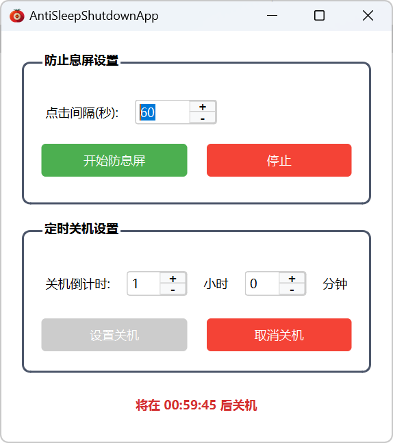

# AntiSleepShutdownApp

一个用于防止屏幕息屏和定时关机的Windows软件。

基于Pyside6开发。

## 使用

下载打包好的软件： [releases](https://github.com/MGzhou/AntiSleepShutdownApp/releases/tag/App)

如何需要自行运行，可以参考下面说明。

## 代码

### 环境

```
PySide6
pywin32
```

### 运行

```
python main.py
```

## 界面


